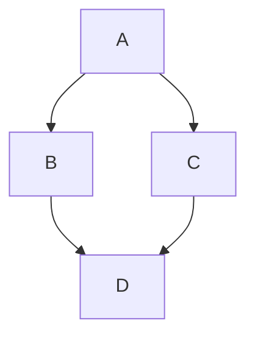

# Create a Page

Add **Markdown or React** files to `src/pages` to create a **standalone page**:

- `src/pages/index.js` → `localhost:3000/`
- `src/pages/foo.md` → `localhost:3000/foo`
- `src/pages/foo/bar.js` → `localhost:3000/foo/bar`

## Create your first React Page

Create a file at `src/pages/my-react-page.js`:

```jsx title="src/pages/my-react-page.js"
import React from 'react';
import Layout from '@theme/Layout';

export default function MyReactPage() {
  return (
    <Layout>
      <h1>My React page</h1>
      <p>This is a React page</p>
    </Layout>
  );
}
```

A new page is now available at [http://localhost:3000/my-react-page](http://localhost:3000/my-react-page).

## Create your first Markdown Page

Create a file at `src/pages/my-markdown-page.md`:

```mdx title="src/pages/my-markdown-page.md"
# My Markdown page

This is a Markdown page
```

A new page is now available at [http://localhost:3000/my-markdown-page](http://localhost:3000/my-markdown-page).

## Mermaid



## Math

Let $f\colon[a,b]\to\R$ be Riemann integrable. Let $F\colon[a,b]\to\R$ be
$F(x)=\int_{a}^{x} f(t)\,dt$. Then $F$ is continuous, and at all $x$ such that
$f$ is continuous at $x$, $F$ is differentiable at $x$ with $F'(x)=f(x)$.
